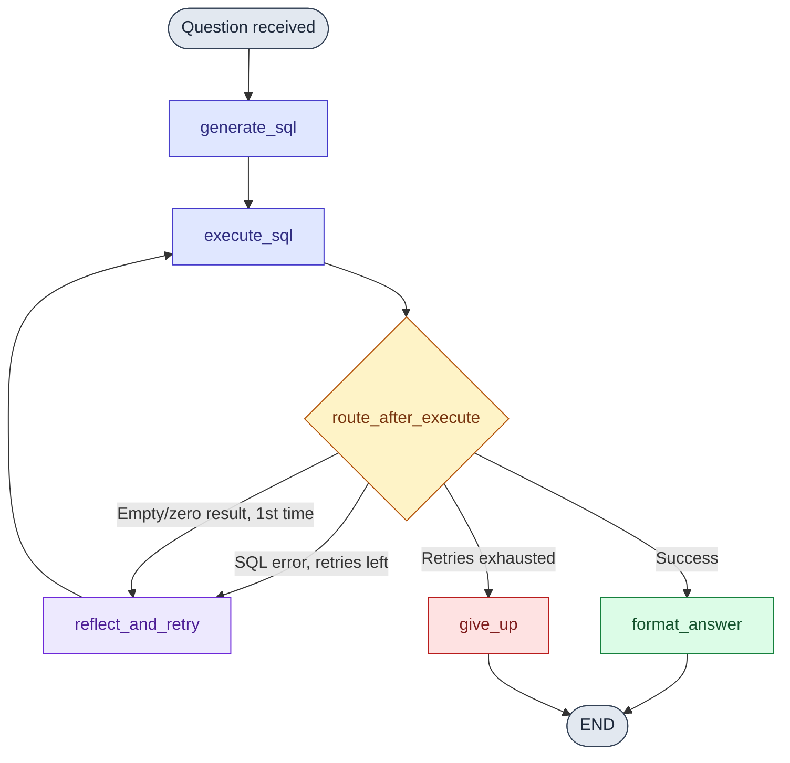
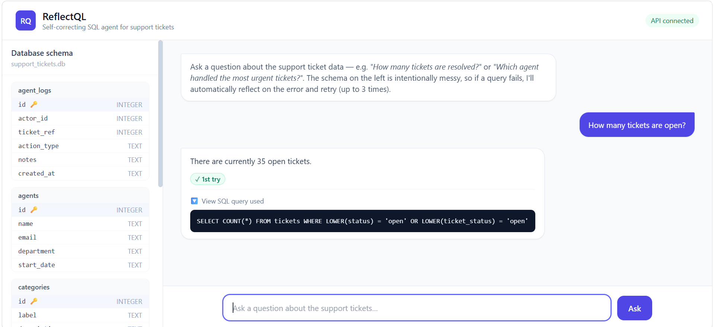

<div align="center">

# ReflectQL : Self-Correcting SQL Agent

[](https://www.python.org/)
[](https://fastapi.tiangolo.com/)
[](https://langchain-ai.github.io/langgraph/)
[](https://ai.google.dev/)
[](https://www.sqlite.org/)
[](https://tailwindcss.com/)

</div>

<br>

A small web app where you ask a plain-English question about a support ticket
system, an LLM turns it into SQL, runs it against a local SQLite database,
and if the query is wrong **automatically catches the error, reflects on
it, and retries** (up to 3 times) before answering you.

The whole point of this project is to make that self-correction loop visible
and demonstrable, not to hide it behind a clean "it just worked" answer.

```
ReflectQL/
├── backend/
│   ├── main.py            FastAPI app (POST /ask, GET /schema)
│   ├── agent.py            LangGraph state graph (the self-correction loop)
│   ├── database.py          SQLite schema + Faker seed data
│   ├── requirements.txt
│   └── .env.example
├── frontend/
│   └── index.html            Chat UI + schema sidebar (Tailwind CDN, vanilla JS)
├── README.md
└── .gitignore
```

<br>

## Table of Contents

- [Setup](#setup)
- [Why the self-correction loop exists](#why-the-self-correction-loop-exists)
- [How the LangGraph loop works](#how-the-langgraph-loop-works)
- [Inspect the database directly](#inspect-the-database-directly)
- [Example questions to try in a demo](#example-questions-to-try-in-a-demo)
- [Screenshot](#screenshot)

---

## Setup

1. **Install dependencies**
   ```bash
   cd backend
   pip install -r requirements.txt
   ```

2. **Add your Gemini API key**
   ```bash
   cp .env.example .env
   # edit .env and paste your key from https://aistudio.google.com/api-keys
   ```

3. **Seed the database**
   ```bash
   python database.py
   ```
   This creates `backend/support_tickets.db` with ~300 rows of synthetic data
   across 5 tables (customers, categories, agents, tickets, agent_logs). It's
   safe to re-run any time — it drops and recreates the tables.

4. **Run the backend**
   ```bash
   uvicorn main:app --reload
   ```
   The API is now at `http://127.0.0.1:8000`. Watch this terminal during a
   demo — every attempt, error, and correction is printed live.

5. **Open the frontend**
   Just open `frontend/index.html` directly in a browser (double-click it,
   or `open frontend/index.html` / drag it into a browser tab). No build step,
   no server required for the frontend itself.

   > If your browser blocks `fetch()` from a `file://` page, serve it instead:
   > `python -m http.server 5500 --directory frontend` and visit
   > `http://127.0.0.1:5500`.

---

## Why the self-correction loop exists

The database schema for this demo was built to look like *real* production
data at a small SaaS company that's been bolting on tables for years — messy,
inconsistent, but not unusual. Specifically:

**1. Two overlapping "status" columns on `tickets`.**
`status` is the coarse lifecycle state (`open` / `in_progress` / `closed`).
`ticket_status` is a separate, finer-grained resolution/queue state (`new` /
`pending_customer` / `escalated` / `resolved` / `duplicate`). A question like
*"how many tickets are resolved?"* is genuinely ambiguous between the two
columns, and an LLM's first guess is often wrong. When the query returns 0
rows for a question that clearly should have data, the agent notices,
re-reads the schema, and retries against the other column.

**2. Foreign keys that don't follow the `<table>_id` convention.**
`tickets.requester_id` → `customers.id`, `tickets.cat_id` → `categories.id`,
`tickets.handler_id` → `agents.id`, `agent_logs.actor_id` → `agents.id`,
`agent_logs.ticket_ref` → `tickets.id`. An LLM that pattern-matches on naming
conventions instead of reading the schema will write a join on a column that
doesn't exist (e.g. `tickets.customer_id`) — a hard SQL error the agent can
catch and fix immediately.

**3. Two similarly named, easily confused tables.**
`agents` (one row per support agent) vs. `agent_logs` (one row per action an
agent took). A question like *"how many agents worked on ticket #42?"* invites
counting the wrong table or skipping a needed join through `agent_logs`.

None of these are exotic edge cases — they're the ordinary result of years of
incremental schema changes at a real company. **ReflectQL's value proposition
is that instead of silently returning a wrong (but valid-looking) answer, the
agent's execution errors and suspiciously-empty results become a signal to
re-read the schema and try again**, and it shows you exactly how many
attempts that took.

---

## How the LangGraph loop works



- **`generate_sql`** — LLM writes a first-pass SQL query from the question,
  with the full live schema (tables, columns, foreign keys) as context.
- **`execute_sql`** — runs the query against SQLite, catching any
  `sqlite3.Error` instead of crashing.
- **`reflect_and_retry`** — feeds the failing query + the exact error message
  (or "0 rows returned" for a suspiciously empty result) back to the LLM and
  asks for a corrected query. Capped at 3 total attempts.
- **`format_answer`** — once a query succeeds, a second LLM call turns the raw
  rows into a plain-English answer.
- **`give_up`** — if 3 attempts are exhausted without a working query, returns
  a graceful message with the last error shown, instead of hanging or
  crashing.

The API response (and the UI's "✓ succeeded after N attempts" badge) always
reports the real attempt count and the exact final SQL query used, so the
self-correction is demonstrable, not hidden.

---

## Inspect the database directly

To check the agent's answers by hand, run this in your terminal (from the project root):
```bash
python -m sqlite3 backend/support_tickets.db
```
This opens an interactive SQLite shell. From there, type SQL directly, e.g.:
```sql
SELECT status, COUNT(*) FROM tickets GROUP BY status;
```
Type `.quit` to exit back to your normal terminal.

---

## Example questions to try in a demo

- "How many tickets are currently open?"
- "How many tickets are resolved?" *(ambiguous status column — good for
  showing a retry)*
- "Which customer has submitted the most tickets?"
- "How many urgent priority tickets are unassigned?"
- "Which agent has the most activity logged against their tickets?"
- "List the 5 most recent billing issue tickets."

---

## Screenshot

